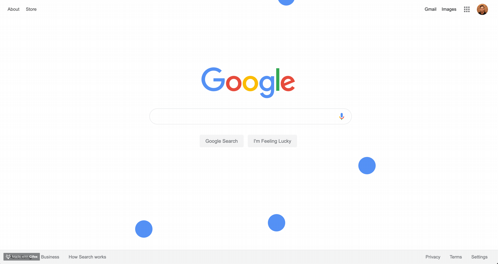

# physics

[](http://npm.im/physics-jumpy)
[](http://npm-stat.com/charts.html?package=physics-jumpy&from=2015-08-01)
[](http://opensource.org/licenses/MIT)
[](https://github.com/semantic-release/semantic-release)



## Installation

```
npm i
```

## Publishing

```
lerna version
```

then submit PR to master

## Packages

[jumpy](https://github.com/qaiken/physics/tree/master/packages/physics-jumpy)

[projectile](https://github.com/qaiken/physics/tree/master/packages/physics-projectile)
